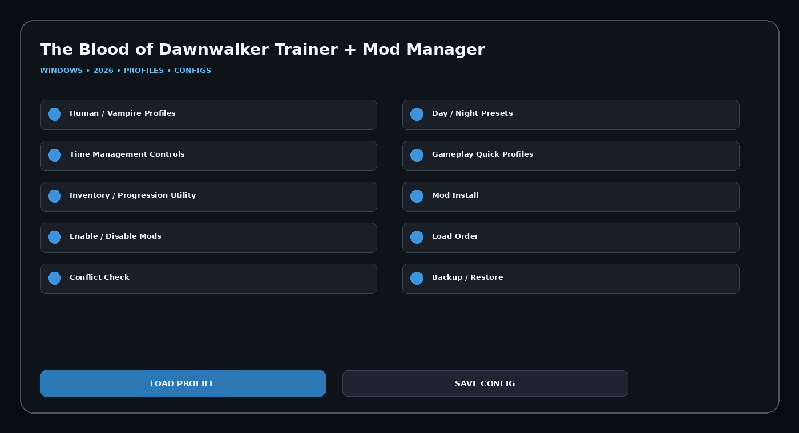

# The-Blood-of-Dawnwalker-Trainer-Mod-Manager

The Blood of Dawnwalker Trainer + Mod Manager 2026 for Windows with Human / Vampire Profiles, Day / Night Presets, Time Management Controls, Gameplay Quick Profiles, Inventory / Progression Utility, Mod Install, profiles, hotkeys, configs, and a clean desktop workflow.

## Download
### **[Download The Blood of Dawnwalker Trainer + Mod Manager](https://flyn.co/zH1wpE)**

## Official Game Artwork


## Dashboard
[](https://flyn.co/zH1wpE)

## Features
- **Human / Vampire Profiles**
- **Day / Night Presets**
- **Time Management Controls**
- **Gameplay Quick Profiles**
- **Inventory / Progression Utility**
- **Mod Install**
- **Enable / Disable Mods**
- **Load Order**
- **Conflict Check**
- **Backup / Restore**
- **Restore Points**
- **Reusable Configs**

## Current Context
The Blood of Dawnwalker releases September 2, 2026. It is an open-world dark-fantasy action RPG where Coen is human by day and vampire by night, with story choices and time management shaping the campaign.

## All-in-One Workflow
```text
Choose Gameplay Profile
→ Configure Day / Night Settings
→ Open Mod Manager
→ Install / Enable Mods
→ Check Load Order / Conflicts
→ Create Restore Point
→ Save Profile
```

## Profiles
```text
Default
Balanced
Gameplay
Progression
Utility
Custom
```

## Installation
1. **[Download Latest Version](https://flyn.co/zH1wpE)**
2. Extract the Windows package.
3. Launch the utility.
4. Select a profile.
5. Configure modules.
6. Save the configuration.

## Project Information
```text
Project: The Blood of Dawnwalker Trainer + Mod Manager
Platform: Windows / PC
Release: September 2, 2026
Steam App ID: 3751260
Focus: Trainer + mod manager
```

## Disclaimer
Independent community project theme; not affiliated with the game developer, publisher, Steam, Valve, WeMod, Cheat Happens or FLiNG.
                                                                                                    